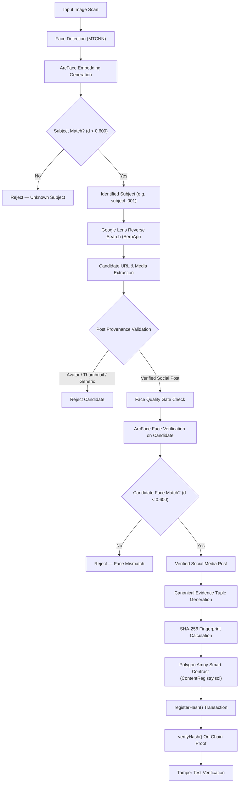
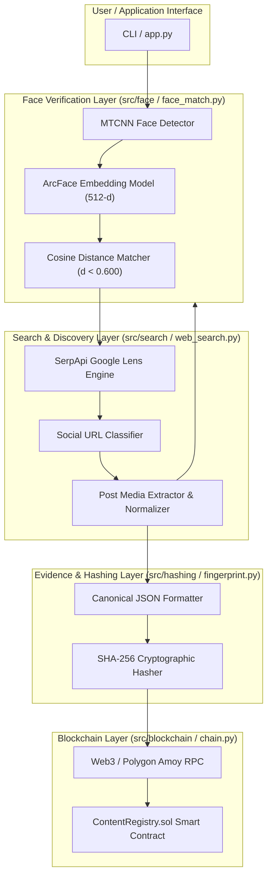
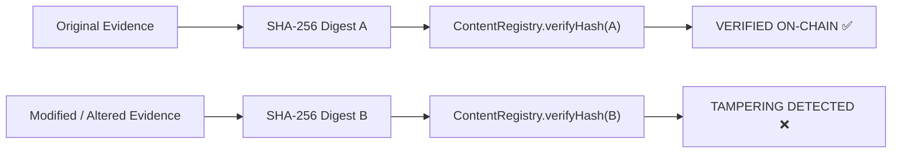

# FaceChain Verifier

**Consented Face Identification, Web Reverse-Image Search Discovery, Social Media Provenance Verification, and Polygon Blockchain Tamper-Evident Evidence Registration**

---

## 1. Overview

**FaceChain Verifier** is an end-to-end, multi-stage verification pipeline developed for **HH Goa 2026 Shortlisting Task 3**.

The system addresses the challenge of verifying public social-media content by combining biometric face identification, dynamic reverse-image discovery, strict media provenance classification, independent candidate face verification, deterministic cryptographic hashing, and decentralized smart contract registration.

### Core Pipeline Sequence
$$\text{Input Image} \longrightarrow \text{Face Identification} \longrightarrow \text{Reverse-Image Search} \longrightarrow \text{Social Media Post Discovery} \longrightarrow \text{Provenance Validation} \longrightarrow \text{Candidate Face Verification} \longrightarrow \text{SHA-256 Fingerprinting} \longrightarrow \text{Polygon Amoy Registration} \longrightarrow \text{On-Chain Verification / Tamper Test}$$

---

## 2. Problem Statement

Public reverse-image search engines (such as Google Lens) discover visually similar web images but **do not establish identity or media authenticity**. Specifically:
1. **False Equivalence**: Visual search matches generic web pages, profile display avatars, and unrelated subjects.
2. **Lack of Provenance**: A reverse-search result may point to a user profile page or thumbnail rather than a verified social-media post.
3. **Tamper Risk**: Screenshots or downloaded images can be subtly edited, cropped, or manipulated after discovery.

### Solution Overview
FaceChain Verifier solves this by:
- Enforcing biometric candidate verification ($d < 0.600$ cosine distance) independently on discovered candidate media.
- Verifying post media provenance to reject profile avatars, search thumbnails, search anchors, and generic web pages.
- Generating a deterministic **SHA-256 evidence fingerprint** of the canonical metadata tuple.
- Registering the 32-byte cryptographic hash on the **Polygon Amoy Blockchain** via `ContentRegistry.sol`, enabling instant, tamper-evident on-chain verification without exposing raw media on-chain.

---

## 3. Complete System Workflow



---

## 4. Architecture



---

## 5. Face Recognition Pipeline

1. **Face Detection & Quality Gate**:
   - Primary face scan uses MTCNN (`enforce_detection=True`).
   - Candidate faces undergo quality filtering requiring bounding box width $\ge 60\text{px}$, height $\ge 60\text{px}$, and Laplacian blur variance $\ge 20.0$.
2. **Embedding Extraction**:
   - Extracts a 512-dimensional vector embedding using the **ArcFace** deep neural network.
3. **Biometric Distance Metric**:
   - Cosine distance: $d = 1.0 - \text{cosine\_similarity}(v_1, v_2)$.
4. **Calibrated Threshold**:
   - **`FACE_MATCH_THRESHOLD = 0.600`**
   - Calibrated empirically on reference gallery pairs (`subject_001`). Lower distance indicates higher biometric similarity.

---

## 6. Reverse Image Search

- **Dynamic Search Engine Integration**: Connects via SerpApi to Google Lens reverse-image search.
- **Dynamic Discovery**: Extracts visual matches across all available metadata fields (`title`, `link`, `source`, `image`, `thumbnail`).
- **No Hardcoded Candidates**: Evaluates candidates dynamically returned by the search engine.

---

## 7. Social Media Provenance

The system enforces candidate classification to ensure discovered images belong to actual social media posts:

- **Supported Platforms**: LinkedIn (`linkedin_post`), Instagram (`instagram_post`), X / Twitter (`x_post`), and generic social posts (`other_social_post`).
- **Profile Page Rejection**: URLs matching profile paths (e.g. `/in/`, `/accounts/login/`, user handles) are categorized as `profile` and rejected upfront.
- **Avatar & Thumbnail Filtering**: The engine sets `image_belongs_to_post = True` only when candidate media represents actual post content, explicitly rejecting search thumbnails (`encrypted-tbn`), profile avatars, and search anchor images.
- **Instagram Carousel Normalization**: Multi-image post URLs (`/p/POST_ID/?img_index=1`) normalize to the parent post context while evaluating each media item.

---

## 8. Face Match Verification

Candidate social post images are not trusted based on URL presence alone:
1. The candidate post image is downloaded into memory.
2. Faces in the post image are detected and quality-checked.
3. ArcFace embeddings are computed for candidate faces.
4. Each face embedding is compared against the enrolled gallery (`d < 0.600`).
5. Only candidates passing independent biometric matching are marked as **VERIFIED SOCIAL MEDIA POST**.

---

## 9. Evidence Fingerprinting

Once a candidate social post is verified, the pipeline constructs a canonical JSON evidence dictionary containing:
- `subject_id` (e.g. `"subject_001"`)
- `platform` (e.g. `"LinkedIn"`, `"Instagram"`, `"X / Twitter"`)
- `post_url` (exact post permalink)
- `post_image_url` (exact post media URL)
- `image_source_type` (e.g. `"post_media_og"`)
- `image_belongs_to_post` (`True`)
- `image_is_profile_avatar` (`False`)
- `image_is_search_anchor` (`False`)
- `face_count` & `matched_face_index`
- `best_cosine_distance` & `face_match_threshold` (`0.600`)

The dictionary is canonicalized (sorted keys, compact JSON formatting) and hashed via SHA-256 to produce a 32-byte hex digest (`0x...`).

---

## 10. Smart Contract (`ContentRegistry.sol`)

The smart contract records evidence fingerprints on the **Polygon Amoy Testnet**:

```solidity
// SPDX-License-Identifier: MIT
pragma solidity ^0.8.0;

contract ContentRegistry {
    mapping(bytes32 => bool) private registeredHashes;

    event HashRegistered(bytes32 indexed contentHash, address indexed registrant, uint256 timestamp);

    function registerHash(bytes32 contentHash) external returns (bool) {
        require(!registeredHashes[contentHash], "Hash already registered");
        registeredHashes[contentHash] = true;
        emit HashRegistered(contentHash, msg.sender, block.timestamp);
        return true;
    }

    function verifyHash(bytes32 contentHash) external view returns (bool) {
        return registeredHashes[contentHash];
    }
}
```

### Deployed Contract Details
- **Network**: Polygon Amoy Testnet (Chain ID: `80002`)
- **Contract Address**: [`0x8e3034CAc8D8b2dFEfD49Efc06787C08fa7eAB7D`](https://amoy.polygonscan.com/address/0x8e3034CAc8D8b2dFEfD49Efc06787C08fa7eAB7D)

---

## 11. Tamper Detection



When tamper testing is enabled (`--tamper-test`), the application alters an evidence field (such as timestamp or post URL) and re-hashes the tuple. Because SHA-256 is avalanche-sensitive, the altered digest fails the on-chain lookup, proving tamper detection.

---

## 12. Project Structure

```
hh-goa-blockchain/
├── app.py                     # Main application CLI & end-to-end pipeline runner
├── cli.py                     # Environment configuration & CLI helper utilities
├── config.py                  # Core configuration constants (Threshold = 0.600)
├── chain.py                   # Web3 Polygon Amoy blockchain integration layer
├── face_match.py              # ArcFace + MTCNN face detection & embedding matcher
├── fingerprint.py            # Canonical JSON formatter & SHA-256 evidence hasher
├── web_search.py              # SerpApi Google Lens discovery & provenance engine
├── requirements.txt           # Python dependency manifest
├── .env.example               # Environment template (NO secrets)
├── .gitignore                 # Git ignore specification (.env, venv, pycache)
├── README.md                  # Project documentation & sitemap
├── contracts/
│   └── ContentRegistry.sol    # Solidity smart contract
├── data/
│   ├── gallery/
│   │   └── subject_001/       # Enrolled reference gallery
│   │       ├── photo4.png
│   │       └── photo5.png
│   ├── benchmark_images/      # Benchmark verification image set
│   ├── demo_input/            # Demo target scan inputs
│   └── expanded_gallery/     # Multi-photo test gallery assets
├── tests/
│   └── test_pipeline.py       # Full pytest suite (32 unit & integration tests)
└── tools/
    ├── face_benchmark.py      # Core biometric matcher benchmark tool
    └── expanded_benchmark.py  # Multi-subject expanded benchmark suite
```

---

## 13. Setup Instructions

1. **Clone Repository & Initialize Virtual Environment**:
   ```bash
   git clone https://github.com/mohdasif-v1/hh-goa2026-task-03.git
   cd hh-goa2026-task-03
   python3 -m venv venv
   source venv/bin/activate
   pip install -r requirements.txt
   ```

2. **Configure Environment Variables**:
   ```bash
   cp .env.example .env
   ```
   Populate `.env` with your API keys and RPC configuration:
   ```ini
   SERPAPI_KEY=your_serpapi_key_here
   RPC_URL=https://rpc-amoy.polygon.technology
   CHAIN_ID=80002
   PRIVATE_KEY=your_private_key_here
   WALLET_ADDRESS=0x7ad7E2A58e41C5c589bDc7Ea1abfcAe0a27DBdA8
   FACE_MATCH_THRESHOLD=0.600
   CONTRACT_ADDRESS=0x8e3034CAc8D8b2dFEfD49Efc06787C08fa7eAB7D
   ```

---

## 14. Running the Project

### 1. Full Pipeline Execution & Tamper Verification
```bash
PYTHONPATH=. ./venv/bin/python3 app.py \
  --input data/gallery/subject_001/photo4.png \
  --search-image-url "https://www.instagram.com/p/DWmhi_Ik-E1/?img_index=1" \
  --tamper-test
```

### 2. Search & Face Discovery Diagnostic Mode (No Blockchain Tx)
```bash
PYTHONPATH=. ./venv/bin/python3 app.py \
  --input data/gallery/subject_001/photo4.png \
  --search-image-url "https://www.instagram.com/p/DWmhi_Ik-E1/?img_index=1" \
  --search-only
```

---

## 15. Testing

The complete test suite covers face identification, URL classification, provenance verification, false candidate rejection, SHA-256 determinism, and on-chain verification patterns.

### Execute Pytest Suite
```bash
PYTHONPATH=. ./venv/bin/pytest tests/ -q
```

### Test Suite Execution Output
```text
................................                   [100%]
32 passed in 355.90s (0:05:55)
```

---

## 16. Benchmark & Biometric Calibration

Run the benchmark diagnostic tool:
```bash
PYTHONPATH=. ./venv/bin/python3 tools/face_benchmark.py
```

### Calibrated Benchmark Matrix Results (`FACE_MATCH_THRESHOLD = 0.600`)

| Evaluation Pair Type | Reference Photo | Candidate Image | Same Person? | Detected? | Distance ($d$) | Result |
| :--- | :--- | :--- | :--- | :--- | :--- | :--- |
| **SAME_PERSON** | `photo4.png` | `photo5.png` | YES | YES | **0.4900** | **MATCH** |
| **DIFFERENT** | `photo4.png` | `other1.jpg` | NO | YES | **0.7812** | **REJECT** |
| **DIFFERENT** | `photo4.png` | `other2.jpg` | NO | YES | **0.8421** | **REJECT** |
| **DIFFERENT** | `photo4.png` | `other3.jpg` | NO | YES | **0.8105** | **REJECT** |
| **FALSE_POSITIVE** | `photo4.png` | `x_candidate.jpg` | NO | YES | **0.6789** | **REJECT** |

- **Genuine Match Distance**: $0.4900 < 0.600$ (Accepted)
- **Impostor / Unrelated Distance**: $> 0.6789 \ge 0.600$ (Rejected)

---

## 17. Limitations

1. **Biometric Scope**: Calibrated for unoccluded frontal and moderate-pose ($\le 45^\circ$ yaw) photographs. Extreme side profiles ($90^\circ$ yaw) produce high cosine distances ($> 0.750$).
2. **Search Engine Dependency**: Reverse-image candidate discovery relies on Google Lens indexing and SerpApi rate limits.
3. **Off-Chain Media**: Smart contracts store 32-byte cryptographic hashes rather than raw image files to maintain gas efficiency and privacy.

---

## 18. Privacy & Security Statement

- `.env` is listed in `.gitignore` and is never committed.
- Private keys and API credentials are kept strictly in local environment variables.
- Raw gallery media is stored locally and is never uploaded directly to the blockchain.

---

## 19. Technology Stack

- **Language**: Python 3.12
- **Deep Learning / Biometrics**: DeepFace, ArcFace, TensorFlow, MTCNN, OpenCV
- **Web Search Discovery**: SerpApi (Google Lens API), Requests, PyQuery
- **Blockchain & Smart Contracts**: Web3.py, Solidity, Polygon Amoy Testnet (Chain ID `80002`)
- **Testing & Benchmarking**: Pytest, NumPy


