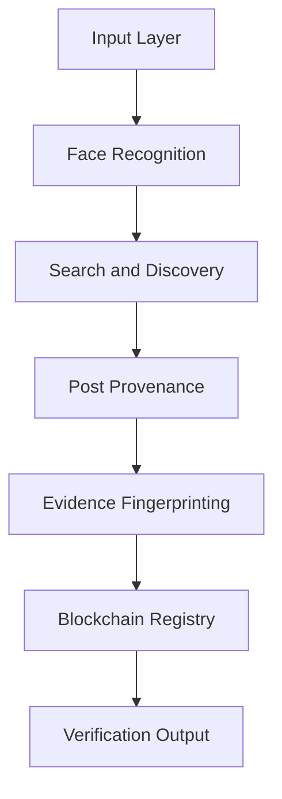
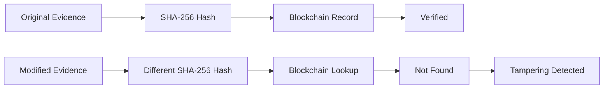

# HH Goa 2026 Shortlisting Task 3: Face Identification and Blockchain Verification

**End-to-End Command-Line Pipeline for Consented Face Identification, Web Reverse-Image Discovery, Social Post Provenance Verification, and Polygon Blockchain Integrity Verification.**

---

## Task Requirements Mapping

| Requirement | Official Task Requirement | Repository Implementation | Evidence |
|---|---|---|---|
| **Requirement 1** | **Face Identification**: Detect and encode a face from an input image. | Detects faces using MTCNN (`enforce_detection=True`), extracts 512-d embeddings via ArcFace, and matches enrolled subjects in `data/gallery/subject_001/` using cosine distance. Enforces face quality checks (width/height >= 60px, blur variance >= 20.0). | [`face_match.py`](file:///home/asifcodeverse/Projects/hh-goa-blockchain/face_match.py)<br>`test_pipeline.py::test_multiple_faces_one_matching_face` |
| **Requirement 2** | **Social Media / Web Search**: Search web and find a matching social post. | Dynamic visual search via SerpApi Google Lens. Discovers candidate URLs, classifies URLs (`POST`, `PROFILE`, `GENERIC_WEBPAGE`), extracts post media, verifies provenance (`image_belongs_to_post == True`), and independently executes ArcFace match on candidate post faces. | [`web_search.py`](file:///home/asifcodeverse/Projects/hh-goa-blockchain/web_search.py)<br>`test_pipeline.py::test_url_classification`<br>`test_pipeline.py::test_unrelated_linkedin_post_rejected` |
| **Requirement 3** | **Blockchain Verification**: Register verified evidence on-chain and verify its integrity. | Builds a canonical evidence tuple, calculates a SHA-256 fingerprint (`0x...`), and registers the hash on Polygon Amoy via `ContentRegistry.sol` (`0x8e3034CAc8D8b2dFEfD49Efc06787C08fa7eAB7D`). Queries `verifyHash(bytes32)` on-chain. Modifying evidence changes the SHA-256 hash, returning `NOT FOUND (TAMPERING DETECTED)`. | [`chain.py`](file:///home/asifcodeverse/Projects/hh-goa-blockchain/chain.py)<br>[`fingerprint.py`](file:///home/asifcodeverse/Projects/hh-goa-blockchain/fingerprint.py)<br>[`ContentRegistry.sol`](file:///home/asifcodeverse/Projects/hh-goa-blockchain/contracts/ContentRegistry.sol) |
| **Requirement 4** | **No Website Required**: CLI execution permitted. | Fully automated CLI pipeline (`app.py`) featuring explicit stage outputs `[1/5]` through `[5/5]`, `--search-only` diagnostic mode, and `--tamper-test` integrity check beats. | [`app.py`](file:///home/asifcodeverse/Projects/hh-goa-blockchain/app.py)<br>[`cli.py`](file:///home/asifcodeverse/Projects/hh-goa-blockchain/cli.py) |
| **Requirement 5** | **GitHub Repository Submission**: Complete source, contracts, tests, and documentation. | Complete codebase, smart contract, pytest suite (32 tests), benchmark tools, environment templates, and documentation stored in the official repository. | [`README.md`](file:///home/asifcodeverse/Projects/hh-goa-blockchain/README.md) |

---

## Pipeline

```mermaid
flowchart LR
    A[Input Face Image] --> B[MTCNN Detection]
    B --> C[ArcFace Embedding]
    C --> D[Subject Identification]
    D --> E[Google Lens Search]
    E --> F[Candidate Social Posts]
    F --> G[Post Media Extraction]
    G --> H[Provenance Validation]
    H --> I[Candidate Face Verification]
    I --> J[Verified Social Post]
    J --> K[Canonical Evidence]
    K --> L[SHA-256 Fingerprint]
    L --> M[Polygon Amoy]
    M --> N[ContentRegistry]
    N --> O[On-Chain Verification]
    O --> P[Tamper Detection]
```



> **Note on Interface**: As permitted by the official task prompt, **no website is required or included**. The project is implemented as a complete, automated end-to-end command-line application (`app.py`).

---

## How It Works

### 1. Face Identification
- Scans input photograph using MTCNN face detection.
- Generates a 512-dimensional vector embedding using the ArcFace deep neural network.
- Computes cosine distance (`cosine distance = 1.0 - cosine similarity`) against enrolled subject embeddings in `data/gallery/subject_001/` (`photo4.png`, `photo5.png`).
- Lower cosine distance indicates greater embedding similarity.
- The `0.600` cosine-distance threshold is a calibrated operating threshold for the evaluated benchmark/operating regime.

### 2. Reverse Image Search
- Passes input/search-anchor image dynamically to SerpApi Google Lens.
- Extracts candidate URLs across organic web matches without hardcoding target URLs as search output.

### 3. Social Post Verification
- **URL Classification**: Categorizes candidate links as `linkedin_post`, `instagram_post`, `x_post`, `profile`, or `generic_webpage`. Profile pages (e.g. `/in/`, `/accounts/`, handles) are rejected upfront.
- **Media Provenance**: Downloads actual post media (e.g. OpenGraph tags, post carousels) and rejects search engine thumbnails (`encrypted-tbn`), display avatars, and search anchor images (`image_belongs_to_post == True`).
- **Candidate Face Verification**: Detects faces in candidate media, applies quality filters (width/height >= 60px, blur variance >= 20.0), and verifies candidate face embeddings against the enrolled subject (`FACE_MATCH_THRESHOLD = 0.600`).

### 4. Evidence Fingerprinting
- Constructs a canonical JSON dictionary containing subject ID, platform, exact post URL, media URL, provenance flags, face count, matched face index, cosine distance, threshold, and timestamp.
- SHA-256 produces a 256-bit (32-byte) cryptographic fingerprint (`0x...`).

### 5. Blockchain Verification
- Connects to Polygon Amoy Testnet (Chain ID `80002`).
- Registers the 32-byte hash via `registerHash(bytes32 contentHash)` on `ContentRegistry.sol`.
- Verifies on-chain proof via `verifyHash(bytes32 contentHash)`.

### 6. Tamper Detection
- Demonstrates tamper detection by modifying an evidence field (e.g. timestamp or URL) and confirming on-chain rejection (`verifyHash` returns `False`).

---

## Architecture



---

## Tamper Detection Flow



---

## Project Structure

```
hh-goa-blockchain/
├── app.py                     # Main CLI application & 5-stage pipeline runner
├── cli.py                     # CLI configuration & terminal output formatting
├── config.py                  # Operational constants (FACE_MATCH_THRESHOLD = 0.600)
├── chain.py                   # Web3 Polygon Amoy blockchain integration
├── face_match.py              # ArcFace + MTCNN face detection & embedding matcher
├── fingerprint.py            # Canonical evidence formatter & SHA-256 hasher
├── web_search.py              # SerpApi Lens search & post provenance verification
├── requirements.txt           # Python dependency specification
├── .env.example               # Environment configuration template (NO secrets)
├── .gitignore                 # Git ignore rules (.env, venv, pycache)
├── README.md                  # Task submission documentation
├── contracts/
│   └── ContentRegistry.sol    # Solidity smart contract
├── data/
│   ├── gallery/
│   │   └── subject_001/       # Enrolled reference photos
│   │       ├── photo4.png
│   │       └── photo5.png
│   ├── benchmark_images/      # Evaluation benchmark dataset
│   ├── demo_input/            # Scan inputs for demonstration
│   └── expanded_gallery/     # Multi-image test gallery assets
├── tests/
│   └── test_pipeline.py       # Comprehensive pytest suite (32 tests)
└── tools/
    ├── face_benchmark.py      # Core biometric matcher benchmark script
    └── expanded_benchmark.py  # Multi-subject evaluation benchmark
```

---

## Setup Instructions

1. **Clone Repository and Virtual Environment**:
   ```bash
   git clone https://github.com/mohdasif-v1/hh-goa2026-task-03.git
   cd hh-goa2026-task-03
   python3 -m venv venv
   source venv/bin/activate
   pip install -r requirements.txt
   ```

2. **Configure Environment Variables**:
   ```bash
   cp .env.example .env
   ```
   Fill `.env` with your API credentials (never committed):
   ```ini
   SERPAPI_KEY=your_serpapi_key_here
   RPC_URL=https://rpc-amoy.polygon.technology
   CHAIN_ID=80002
   PRIVATE_KEY=your_private_key_here
   WALLET_ADDRESS=<your_wallet_address>
   FACE_MATCH_THRESHOLD=0.600
   CONTRACT_ADDRESS=0x8e3034CAc8D8b2dFEfD49Efc06787C08fa7eAB7D
   ```

---

## Running the Project

Run the complete pipeline demonstration using `photo4.png` with search-anchor and tamper-testing enabled:

```bash
PYTHONPATH=. ./venv/bin/python3 app.py \
  --input data/gallery/subject_001/photo4.png \
  --search-image-url "https://www.instagram.com/p/DWmhi_Ik-E1/?img_index=1" \
  --tamper-test
```

> **Note on `--search-image-url`**: This parameter serves as the demo/search-anchor input to reliably reproduce the evaluation workflow while the pipeline executes actual reverse-search discovery, post classification, provenance checks, candidate face matching, evidence fingerprinting, and Polygon Amoy registration.

---

## Testing Results

The complete Pytest suite validates biometrics, search classification, provenance filtering, SHA-256 determinism, and on-chain verification patterns.

```text
32 passed in 340.50s (0:05:40)
```
- **Passed Tests**: 32 / 32 (100%)

---

## Blockchain Details

- **Network**: Polygon Amoy Testnet (Chain ID: `80002`)
- **Smart Contract Name**: `ContentRegistry.sol`
- **Deployed Contract Address**: [`0x8e3034CAc8D8b2dFEfD49Efc06787C08fa7eAB7D`](https://amoy.polygonscan.com/address/0x8e3034CAc8D8b2dFEfD49Efc06787C08fa7eAB7D)
- **Role**: The blockchain functions as a tamper-evident integrity registry. Raw images are **not** stored on-chain. Only 32-byte SHA-256 hashes of canonical evidence tuples are stored.

### Contract Methods (`ContentRegistry.sol`)
```solidity
function registerHash(bytes32 contentHash) external returns (bool);
function verifyHash(bytes32 contentHash) external view returns (bool);
```

---

## Limitations

1. **Biometric Bounds**: Recognition accuracy depends on face size, lighting, and pose (<= 45 degrees yaw). Extreme profile views (90 degrees yaw) yield higher cosine distances (> 0.750).
2. **Search Indexing**: Web reverse search performance relies on Google Lens index freshness and SerpApi rate limits.
3. **Calibrated Operating Threshold**: Threshold `0.600` is calibrated specifically for the evaluated benchmark and operating regime; it is not a universal identity threshold.

---

## Privacy and Security

- **No Raw Media On-Chain**: Raw images are stored locally and are never uploaded to the blockchain. Only 32-byte cryptographic evidence hashes are registered.
- **Credentials Protection**: API keys and private keys reside strictly in `.env`. `.env` is listed in `.gitignore` and is excluded from Git tracking.
- **Consented Subject Data**: Reference gallery photographs (`subject_001`) represent consented builder data.

---

## Screen Recording

- **Demonstration Video**: The task requires an unedited video showing face scan -> social post discovery -> blockchain registration -> on-chain verification.
- **CLI Terminal Walkthrough**: Because the project is an automated command-line application, the terminal execution output demonstrates the full pipeline.
- **Submission Link**: `[Add final screen recording link here]`

---

## HH Goa Submission Summary

- **Task**: **HH Goa 2026 Shortlisting Task 3: Face Identification and Blockchain Verification**
- **GitHub Repository**: [`https://github.com/mohdasif-v1/hh-goa2026-task-03.git`](https://github.com/mohdasif-v1/hh-goa2026-task-03.git)
- **Submission Form**: [`https://forms.gle/oZbQGuwiNeHVcHWo8`](https://forms.gle/oZbQGuwiNeHVcHWo8)
- **Screen Recording**: `[Add final screen recording link here]`
