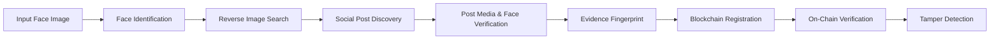
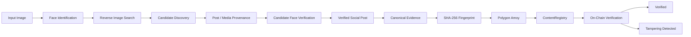
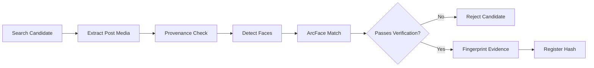
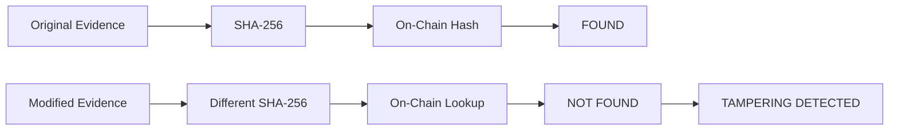

# HH Goa 2026 Shortlisting Task 3: Face Identification & Blockchain Verification

A command-line pipeline that takes a face scan photograph as input, identifies matching content on the web/social media via reverse-image search discovery, verifies media provenance and biometric identity, and registers deterministic tamper-evident evidence on the Polygon Amoy blockchain.



---

## 1. Task Requirements Mapping

| HH Goa Requirement | Repository Implementation | Evidence / Module |
|---|---|---|
| **1. Face Identification** | MTCNN face detection (`enforce_detection=True`), ArcFace 512-d embeddings, cosine distance matching against enrolled reference photos in `data/gallery/subject_001/` (`photo4.png`, `photo5.png`), and quality filtering (width/height >= 60px, blur variance >= 20.0). | [`face_match.py`](file:///home/asifcodeverse/Projects/hh-goa-blockchain/face_match.py)<br>`tests/test_pipeline.py` |
| **2. Social/Web Search** | SerpApi Google Lens reverse-image search using the input scan as a visual search anchor. Dynamically discovers candidate URLs, classifies URLs (`POST`, `PROFILE`, `GENERIC_WEBPAGE`), extracts post media, verifies post provenance, and independently face-verifies candidate media. | [`web_search.py`](file:///home/asifcodeverse/Projects/hh-goa-blockchain/web_search.py)<br>`tests/test_pipeline.py` |
| **3. Blockchain Verification** | Builds canonical evidence tuple, computes SHA-256 fingerprint, and registers hash on Polygon Amoy Testnet via `ContentRegistry.sol` (`0x8e3034CAc8D8b2dFEfD49Efc06787C08fa7eAB7D`). Queries `verifyHash` on-chain for tamper detection. | [`chain.py`](file:///home/asifcodeverse/Projects/hh-goa-blockchain/chain.py)<br>[`fingerprint.py`](file:///home/asifcodeverse/Projects/hh-goa-blockchain/fingerprint.py)<br>[`contracts/ContentRegistry.sol`](file:///home/asifcodeverse/Projects/hh-goa-blockchain/contracts/ContentRegistry.sol) |
| **4. Website** | No website required or included. Implemented as an automated CLI application (`app.py`). | [`app.py`](file:///home/asifcodeverse/Projects/hh-goa-blockchain/app.py)<br>[`cli.py`](file:///home/asifcodeverse/Projects/hh-goa-blockchain/cli.py) |
| **5. GitHub Repository** | Complete codebase, smart contract, pytest suite (32 tests), benchmark tools, environment templates, and documentation stored in the repository. | [`README.md`](file:///home/asifcodeverse/Projects/hh-goa-blockchain/README.md) |

---

## 2. How It Works

### 1. Face Identification
- Scans input photograph using MTCNN face detection.
- Generates a 512-dimensional vector embedding using the ArcFace deep convolutional network.
- Computes cosine distance: `cosine distance = 1.0 - cosine similarity` against enrolled subject embeddings in `data/gallery/subject_001/` (`photo4.png`, `photo5.png`).
- Lower cosine distance indicates greater embedding similarity.
- The `0.600` cosine-distance threshold is a calibrated operating threshold for the evaluated benchmark and operating regime.

### 2. Reverse Image Search
- Passes input/search-anchor image dynamically to SerpApi Google Lens API.
- Extracts candidate web URLs returned by visual match search results rather than returning a hardcoded URL.

### 3. Social Post Verification
- **URL Classification**: Categorizes candidate links as `linkedin_post`, `instagram_post`, `x_post`, `profile`, or `generic_webpage`. Profile pages (e.g. `/in/`, `/accounts/`, handles) are rejected upfront.
- **Media Provenance**: Downloads actual post media (e.g. OpenGraph tags, post carousels) and rejects search engine thumbnails (`encrypted-tbn`), display avatars, and search anchor images (`image_belongs_to_post == True`).
- **Candidate Face Verification**: Detects faces in candidate media, applies quality filters (width/height >= 60px, blur variance >= 20.0), and verifies candidate face embeddings against the enrolled subject (`FACE_MATCH_THRESHOLD = 0.600`).

### 4. Evidence Fingerprinting
- Constructs a canonical JSON dictionary containing `subject_id`, `platform`, `post_url`, `post_image_url`, `image_source_type`, provenance flags, `face_count`, `matched_face_index`, `best_cosine_distance`, `face_match_threshold` (`0.600`), and timestamp.
- SHA-256 produces a 256-bit (32-byte) cryptographic fingerprint (`0x...`).

### 5. Blockchain Verification
- Connects to Polygon Amoy Testnet (Chain ID `80002`).
- Calls `registerHash(bytes32 contentHash)` on smart contract `ContentRegistry.sol` (`0x8e3034CAc8D8b2dFEfD49Efc06787C08fa7eAB7D`).
- Queries `verifyHash(bytes32 contentHash)` on-chain to verify tamper-evident proof.
- Stores cryptographic hashes on-chain rather than raw media.

### 6. Tamper Detection
- Demonstrates tamper detection by modifying an evidence metadata field (such as timestamp or post URL).
- Because SHA-256 is avalanche-sensitive, the altered hash fails `verifyHash` on-chain (`NOT FOUND (TAMPERING DETECTED)`).

---

## 3. Real Architecture



---

## 4. Candidate Verification Data Flow



---

## 5. Tamper Detection Flow



---

## 6. Project Structure

```
hh-goa-blockchain/
├── app.py                     # Main CLI application & 5-stage pipeline runner
├── cli.py                     # CLI configuration & terminal output formatting
├── config.py                  # Operational constants (FACE_MATCH_THRESHOLD = 0.600)
├── chain.py                   # Web3 Polygon Amoy blockchain integration
├── face_match.py              # ArcFace + MTCNN face detection & embedding matcher
├── fingerprint.py            # Canonical evidence formatter & SHA-256 hasher
├── web_search.py              # SerpApi Lens search & post provenance verification
├── requirements.txt           # Python dependency specification
├── .env.example               # Environment configuration template (NO secrets)
├── .gitignore                 # Git ignore rules (.env, venv, pycache)
├── README.md                  # Task submission documentation
├── contracts/
│   └── ContentRegistry.sol    # Solidity smart contract
├── data/
│   ├── gallery/
│   │   └── subject_001/       # Enrolled reference photos
│   │       ├── photo4.png
│   │       └── photo5.png
│   ├── benchmark_images/      # Evaluation benchmark dataset
│   ├── demo_input/            # Scan inputs for demonstration
│   └── expanded_gallery/     # Multi-image test gallery assets
├── tests/
│   └── test_pipeline.py       # Comprehensive pytest suite (32 tests)
└── tools/
    ├── face_benchmark.py      # Core biometric matcher benchmark script
    └── expanded_benchmark.py  # Multi-subject evaluation benchmark
```

---

## 7. Setup Instructions

1. **Clone Repository and Set Up Virtual Environment**:
   ```bash
   git clone https://github.com/mohdasif-v1/hh-goa2026-task-03.git
   cd hh-goa2026-task-03
   python3 -m venv venv
   source venv/bin/activate
   pip install -r requirements.txt
   ```

2. **Configure Environment Variables**:
   ```bash
   cp .env.example .env
   ```
   Fill `.env` with your API credentials locally (never committed):
   ```ini
   SERPAPI_KEY=your_serpapi_key_here
   RPC_URL=https://rpc-amoy.polygon.technology
   CHAIN_ID=80002
   PRIVATE_KEY=your_private_key_here
   WALLET_ADDRESS=your_wallet_address_here
   FACE_MATCH_THRESHOLD=0.600
   CONTRACT_ADDRESS=your_contract_address_here
   ```

---

## 8. Running the Project

Run the complete pipeline demonstration using `photo4.png` with search-anchor and tamper-testing enabled:

```bash
PYTHONPATH=. ./venv/bin/python3 app.py \
  --input data/gallery/subject_001/photo4.png \
  --search-image-url "https://www.instagram.com/p/DWmhi_Ik-E1/?img_index=1" \
  --tamper-test
```

> **Note on `--search-image-url`**: This parameter serves as the demo/search-anchor input to reliably reproduce the evaluation workflow while the pipeline executes actual reverse-search discovery, post classification, provenance checks, candidate face matching, evidence fingerprinting, and Polygon Amoy registration.

### Stage Output Sequence
- `[1/5] Primary Face Identification`: Scans photo, detects face via MTCNN, computes ArcFace embedding, matches `subject_001` (distance < 0.600).
- `[2/5] Social Post Verification`: Executes Lens search, classifies URL, extracts media, verifies provenance (`image_belongs_to_post == True`), detects candidate face, matches ArcFace embedding (distance < 0.600).
- `[3/5] Evidence Fingerprint`: Formats canonical JSON and calculates SHA-256 hash (`0x...`).
- `[4/5] Blockchain Registration`: Broadcasts transaction to `registerHash` on Polygon Amoy. Returns TX hash and block number.
- `[5/5] On-Chain Verification & Tamper Check`: Calls `verifyHash` on-chain (returns `VERIFIED ON-CHAIN ✅`), then alters evidence to demonstrate `TAMPERING DETECTED ❌`.

---

## 9. Testing Results

The complete Pytest suite validates biometrics, search classification, provenance filtering, SHA-256 determinism, and on-chain verification patterns.

```text
32 passed in 340.50s (0:05:40)
```
- **Passed Tests**: 32 / 32 (100%)

---

## 10. Technical Limitations

1. **Biometric Bounds**: Recognition accuracy depends on face size, lighting, and pose (<= 45 degrees yaw). Extreme profile views (90 degrees yaw) yield higher cosine distances (> 0.750).
2. **Search Indexing**: Web reverse search performance relies on Google Lens index freshness and SerpApi rate limits.
3. **Calibrated Operating Threshold**: Threshold `0.600` is calibrated specifically for the evaluated benchmark and operating regime; it is not a universal identity threshold.

---

## 11. Privacy and Security

- **No Raw Media On-Chain**: Raw images are stored locally and are never uploaded to the blockchain. Only 32-byte cryptographic evidence hashes are registered.
- **Credentials Protection**: API keys and private keys reside strictly in `.env`. `.env` is listed in `.gitignore` and is excluded from Git tracking.
- **Consented Subject Data**: Reference gallery photographs (`subject_001`) represent consented builder data.

---

## 12. Submission Summary

- **Task**: **HH Goa 2026 Shortlisting Task 3: Face Identification & Blockchain Verification**
- **GitHub Repository**: [`https://github.com/mohdasif-v1/hh-goa2026-task-03.git`](https://github.com/mohdasif-v1/hh-goa2026-task-03.git)
- **Submission Form**: [`https://forms.gle/oZbQGuwiNeHVcHWo8`](https://forms.gle/oZbQGuwiNeHVcHWo8)
- **Screen Recording**: `[Add final screen recording link here]`
